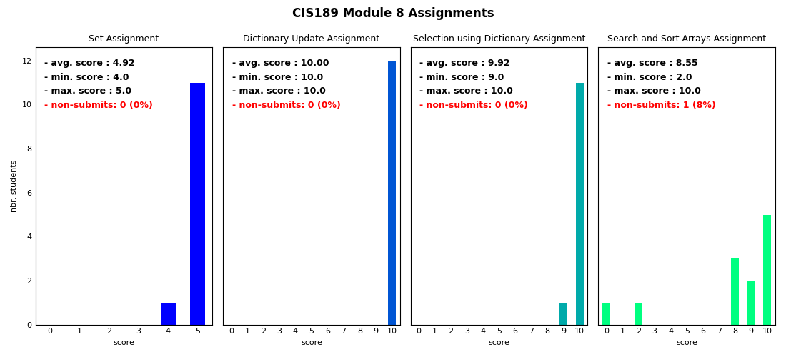

## Grade Distribution Generator from Canvas CSV Files


This utility can be used to produce grade distribution exhibits on a module-by-module
basis for courses hosted in Canvas, specifically for CIS189. 


First, install required dependencies:

```sh
$ python3 -m pip install -r requirements.txt
```

From Canvas, go to *Grades > Export > Export Entire Gradebook*. This will download
a CSV named something along the lines of *YYYY-MM-DDTHHMM_Grades-CIS189_xxxx.csv*. 


Sample invocation (Windows):

```sh
C:\> python exhibit_maker.py ^
    --csv-path="C:/Users/username/Downloads/YYY-MM-DDTHHMM_Grades-CIS189_xxxx.csv" ^
    --img_path="C:/Users/username/Downloads/module-8-grades.png" ^
    --module=8 ^
    --course-desc="CIS189"
```

<br>

Sample invocation (Linux):

```sh
$ python3 exhibit_maker.py \
    --csv-path="/path/to/downloaded/csv/YYY-MM-DDTHHMM_Grades-CIS189_xxxx.csv" \
    --img_path=/path/to/export/module-8-grades.png" \
    --module=8 \
    --course-desc="CIS189"
```

<br>

Sample output:



<br>


### Command Line Options

- `--csv-path`: 
    Absolute path to CSV downloaded from Canvas. 

- `--img_path`:
    Absolute path for exported grade distribution exhibit. If provided path doesn't end with ".png", 
    it will be appended. 

- `--module`: The module for which to generate grade distribution exhibits. 

- `--course-desc`: Coure description used in exhibit super title. Empty by default. 

